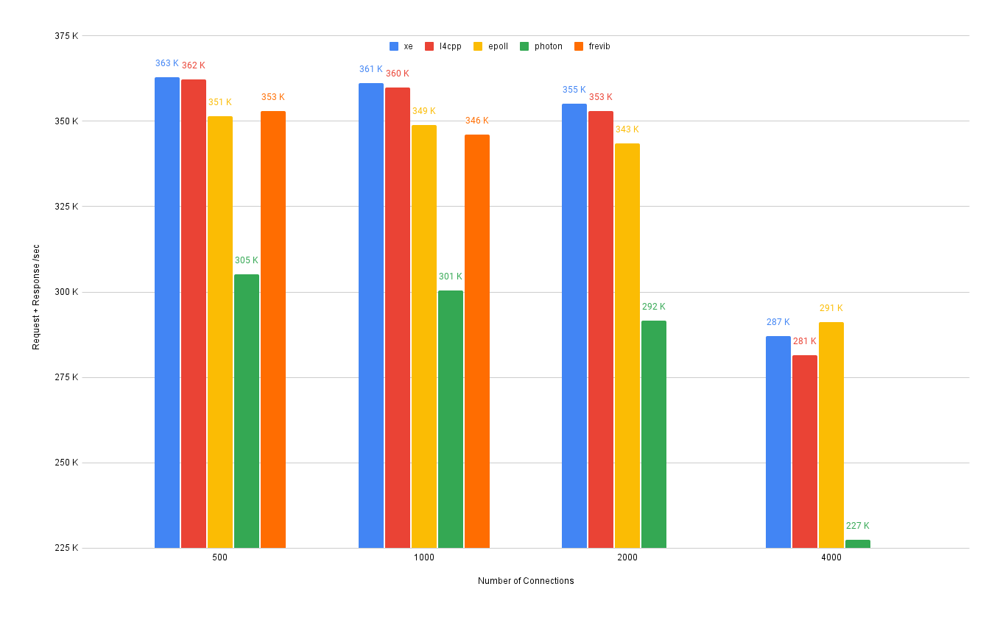

# Benchmarks

Linux native 5.19 
AMD Ryzen 5800X @ 4.50 GHz

All echo servers pinned to CPU 0 
Echo bench threads pinned to CPU 1-4 
Each echo bench thread uses epoll

## Comparisons
- [xe](https://github.com/davidzeng0/xe)
- [l4cpp](https://github.com/CarterLi/liburing4cpp) (aka liburing4cpp)
- [photon](https://github.com/alibaba/PhotonLibOS)
- [frevib](https://github.com/frevib/io_uring-echo-server)
- epoll (native, no framework)

**Bottom of chart cut off to exaggerate differences**

## Notes
- xe is compiled without -flto

- xe, l4cpp, photon, and epoll use 512 byte buffers
- xe, photon, and epoll align buffers to 512 byte boundary

- frevib uses **io_uring_prep_provide_buffers**
- frevib did not complete for 2000 and 4000 connections (sqring size too small)

- xe uses a submission ring size of 256 (faster than 512)
- l4cpp uses a submission ring size of 512 (which is slower when connections > 1000)